## Design Patterns

### Creational Design Patterns

#### Builder :
- We have a complex process to construct an object involving multiple steps, then builder pattern can help us.

- In builder, we remove the logic related to object construction from "client" code & abstract it in a separate class.

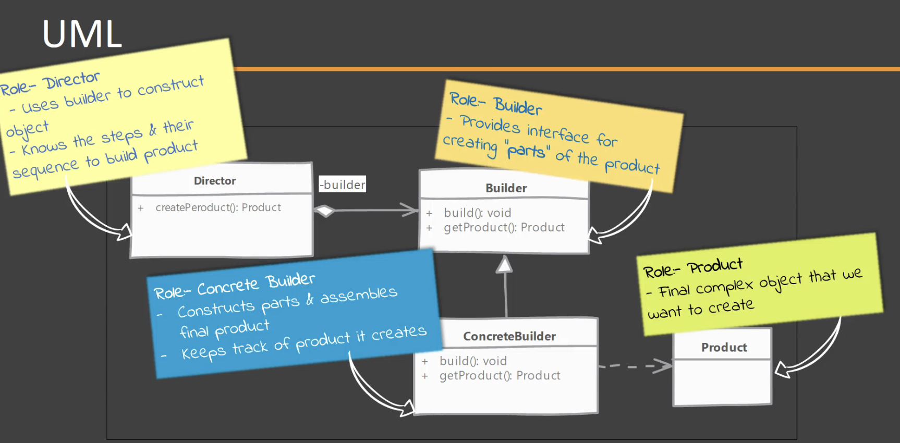

- Implement a builder :
* We start by creating a builder, identifying the parts of the product & provide methods to create those parts.
* It should provide a method to assemble or build the product/object.
* It must provide a way (method) to get fully built object out.
* Optionally - builder can keep reference to a product it has built so the same can be returned again in future.

- Implement a director : 
* A director can be a separate class or client can play the role of director.


#### Problem Builder Design Pattern Solves -
The Builder design pattern solves the problem of constructing complex objects step by step while allowing different variations or representations of the object to be created. It is useful when an object has a complex construction process with many optional parameters or configurations, and you want to separate the construction logic from the object's main business logic.

With the Builder pattern, you can create an object piece by piece, specifying only the components you need, and then use a director (optional) to orchestrate the construction process. This helps in making the construction process more flexible, maintainable, and easier to understand, especially when dealing with objects with multiple configurations or variations.

##### Example -
- StringBuilder class in java.lang.StringBuilder is a builder design pattern implemented class according to GoF definition.
- Builder has potential to build different representations of product interface step by step.
- Calendar class is also a builder design pattern implemented class.

#### Comparison with Prototype design pattern -
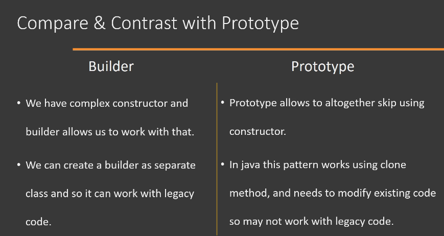

#### Consideration -
- Think of builder dp when you have a complex constructor or an object is built in multiple steps.


#### Simple Factory Design Pattern :
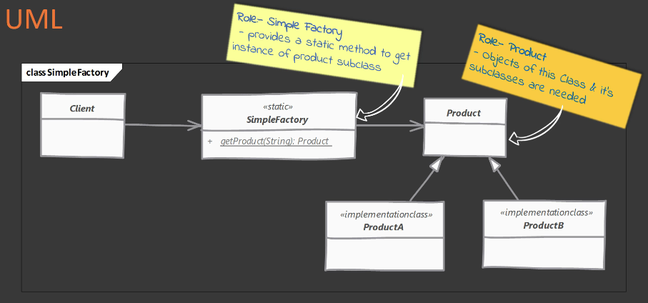

- Separate class will be created to implement Simple Factory.
- A method will be created which will return desired object instance.
- This method will typically accept some argument to decide which class to instantitate.
- You can also provide additional arguments which will be used to instantitate objects.

##### Examples -
- java.text.NumberFormat class has getInstance method, which is an example of Simple Factory.

#### Comparison with Factory Method Pattern :
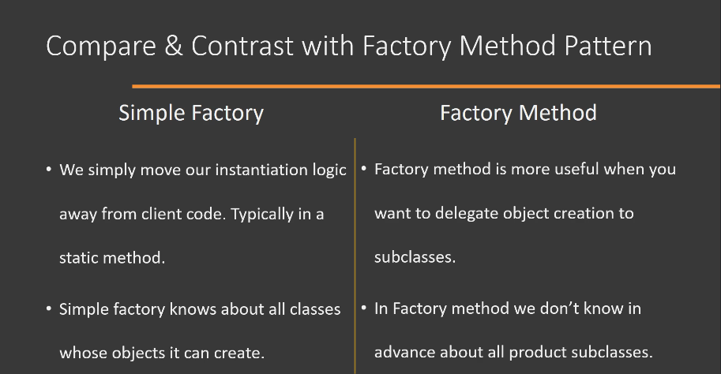

#### Issues :
- The criteria used by Simple Factory to decide which object to instantitate can get more convoluted / complex over time. If you find yourself in such situation then use factory method design pattern.

#### Factory Method Design Pattern :
- Used when we want to move object creation logic out , in a separate class.
- We use this DP, when we don't know in advance which class we may need to instantitate beforehand & also to allow new classes to be added to system and handle their creation without affecting client code.
- We let subclasses decide which object to instantiate by overriding the factory method.

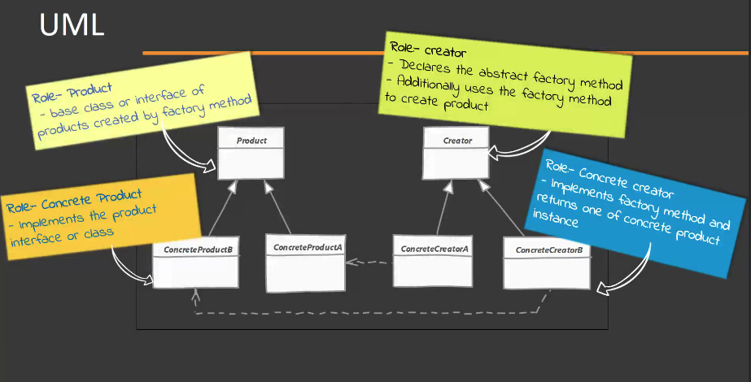

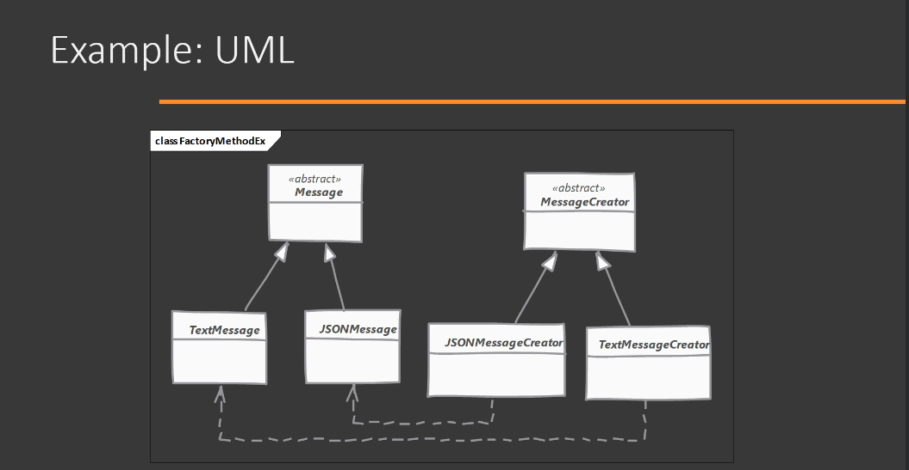

#### Examples :
- java.util.Collection class has a method - iterator(), which is a factory method.
- The most defining characteristic of factory method pattern is - "subclasses providing the actual instance".

#### Issues :
- More complex to implement. More classes involved and need unit testing.
- Not easy to refactor.
- Forces to create subclass to create appropriate object instance.

#### Summary :
- Used when you want to delegate object instantiation to subclasses, you would want to do this when you have "product" heirarchy and possibility of future additions to that.
- We can end up creating conrete classes based on the new requirements of object instantitation.
- For each product concrete class, its corresponding creator class will be added.
    - JSONMessage -> JSONMessageCreator
    - TextMessage -> TextMessageCreator


#### Prototype Design Pattern :
- We have a complex object that is costly to create.
- To create more instances of such classes, we can use existing instances as our prototype.
- Prototype allows us to clone existing objects, and hence saves cost of creating such objects again.

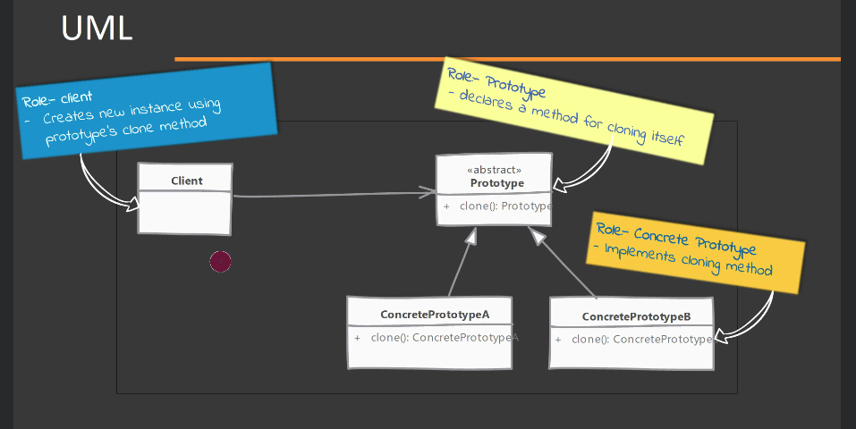

#### Steps :
- A class implementing Cloneable interface.
- Class should override clone() and return copy of itself.
- The method should declare CloneNotSupportedException.
- Clone method implementation should consider the deep & shallow copy and choose whichever is applicable.

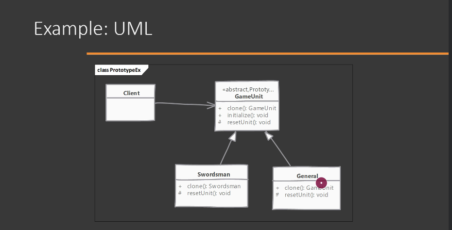

#### Considerations :
- Making sure deep copy & shallow copy of references, immutable fields on clones should save the trouble of deep copy.
- Making sure to reset the state of object before returning its prototype.
- clone() method is protected in Object class and must be overridden to be public to be callable from child class.
- Cloneable is a marker interface, an indication that the class supports cloning.

#### Design Considerations :
- Prototypes are useful when you have large objects where majority of state is unchanged between instances and you can easily identify the state.
- A prototype registry is a class where you can register various prototypes which other code can access to clone out instances. This solves the issue of getting access to initial instance.

#### Example :
- Object.clone() itself is an example of Prototype.

#### Comparison with Singleton :

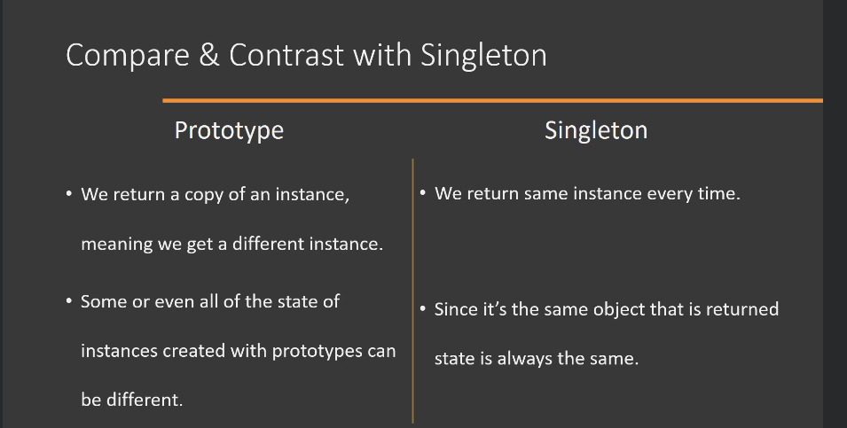

#### Pitfalls :
- Deep copy is by default not supported by Object.clone(), you have to implement it.
- Subclasses may not be able to support clone and so the code becomes complicated as you have to implement wherever it is not supported.

#### Summary :
- Think of prototype when object construction is costly or not possible.
- In Java, its typically implemented within clone().
- Objects which have majority of fields as immutable are good candidates for prototypes.
- Whenever implementing clone(), pay attention to the choice of shallow & deep copy.

#### Abstract Factory Design Pattern :


- Abstract Factory makes use of factory method pattern.
- You can think of AF as an object with multiple factory methods.

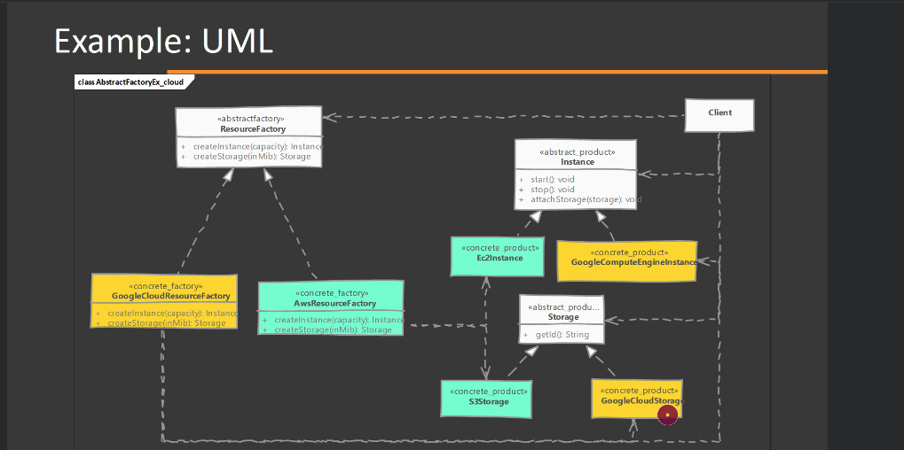

#### Implementation Considerations :
- Factories can be singleton, we typically ever need only one instance of it anyway.
- Adding a new product type requries changes to the base factory as well as implementation of factory.
- We provide the client code with concrete factory.
- Abstract Factory itself uses factory method pattern.
- If objects are too expensive to create, then you can transparently switch factory implementations to use prototype design pattern to create objects.

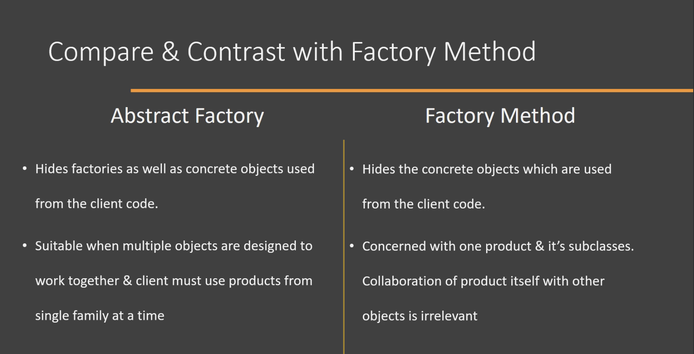

#### Pitfalls :
- Complex to implement than factory method.
- Adding a product requires changes to all the factory implementations.
- Difficult to visualize the need at start of development and usually starts as factory method.
- Abstract factory design pattern is very specific to the problem of "product families".

#### Singleton Design Pattern :
- A class that has only one instance, accessible globally through a single point.
- Main problem this DP solves is to ensure only a single instance of class exist.
- Any state you add in singleton becomes part of "global state" of your application.
- Singleton pattern is used for logging, drivers objects, caching, and thread pool.
- Singleton design pattern is also used in other design patterns like Abstract Factory, Builder, Prototype, Facade, etc.

#### Types of Singleton :
* Eager Initialization
* Lazy Initialization
* Static Block Initialization
* Thread Safe Singleton
* Bill Pugh Singleton
* Using Reflection to destroy Singleton
* Enum Singleton
* Serialization & Singleton

#### Example :
- Singleton design pattern is used in core Java classes also (for example, java.lang.Runtime, java.awt.Desktop).

#### Considerations :
- Always go for eager/lazy singleton approaches, as its the best and preferred way.
- The "classic" singleton pattern uses double check locking and volatile field.
- Singleton creation doesn't need any parameters. If you find yourself in need of support for constructor arguments, you simply need a factory method or simple factory design pattern.

#### Comparison with Factory Method Pattern :

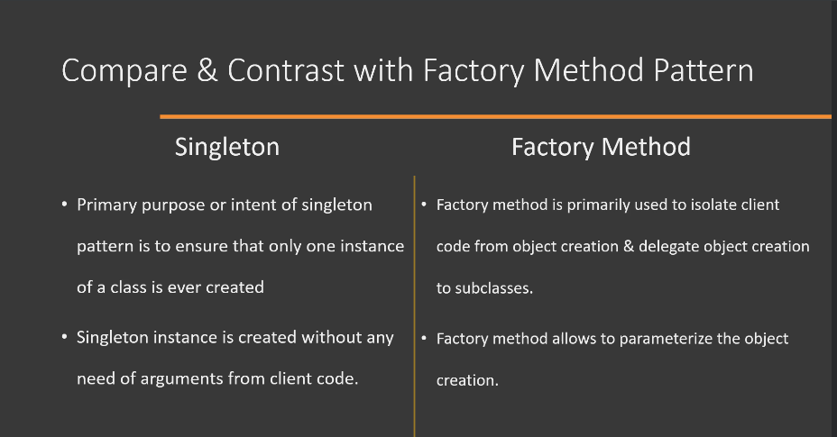

#### Pitfalls :
- Singletons can be difficult to extend or modify later on, especially if they are used extensively throughout your codebase. Changing the behavior of a singleton often requires modifying its implementation directly, which can lead to ripple effects throughout your code.

- Since singletons often rely on static methods or global accessors to retrieve the instance, it can be difficult to mock or stub the singleton instance during testing. This can make unit testing more challenging and can lead to tests that are tightly coupled to the singleton implementation.

- Using singletons can hide dependencies between different components of your application. This can make it harder to understand the relationships between different parts of your code and can lead to tightly coupled and difficult to maintain code.

#### Object Pool Design Pattern :
- If cost of creating an instance is very high and we need a large number of such objects of this class for short duration, then we can use object pool.
- Here, either we pre-create objects of the class or collect unused instances in an in-memory cache.
- It is one of the most complicated patterns to implement efficiently.

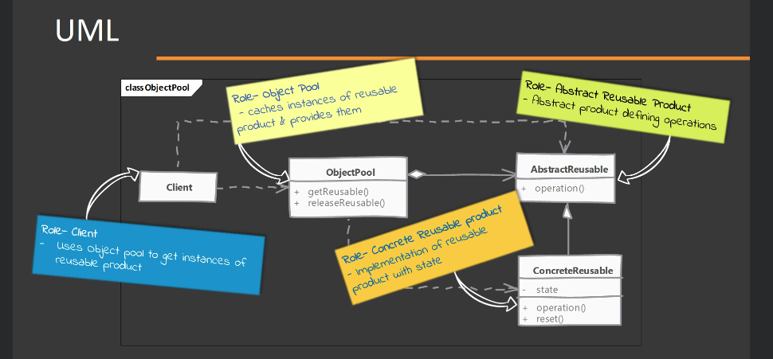

#### Implementation :
- A class shall be created with following considerations :
    * A thread safe caching of objects should be done in pool.
    * Methods to release & acquire of objects should be provided.
    * Pool should reset cached objects before giving them out.
    * The pooled objects should provide methods to reset its state upon "release" by code.
    * Decision - Whether to create new objects for pool when pool is empty or wait until an object becomes available.

#### Design Considerations :
- Resetting objects in pool should not be costly otherwise we may end up losing performance of our application.
- Pre-caching objects could provide add-up benefit.
- Object pool's synchronization should consider the reset time needed & avoid resetting in synchronized context if possible.

#### Example :
- java.util.concurrent.ThreadPoolExecutor used for pooling threads. Its often used via ExecutorService interface using methods like newCachedThreadPool().

- Example :: ExecutorService service = Executors.newCachedThreadPool();

- Apache commons dbcp is used for db connection pooling. BasicDataSource in dbcp package uses this DP to pool db connection objects.

#### Comparison with Prototype :

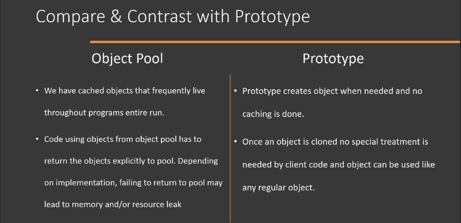

### Structural Design Patterns
- Structural patterns deals with how objects and classes are composed & arranged.

#### Adapter Design Pattern :
- We have an existing object which provides functionality that client needs.
- But client code can't use this object because it expects an object with different interface.
- Using adapter DP, we make this existing object work with client by adapting the object to client's expected interface.
- This pattern is also called as wrapper as it wraps the existing objects.
- Types : [Class Adapter, Object Adapter]

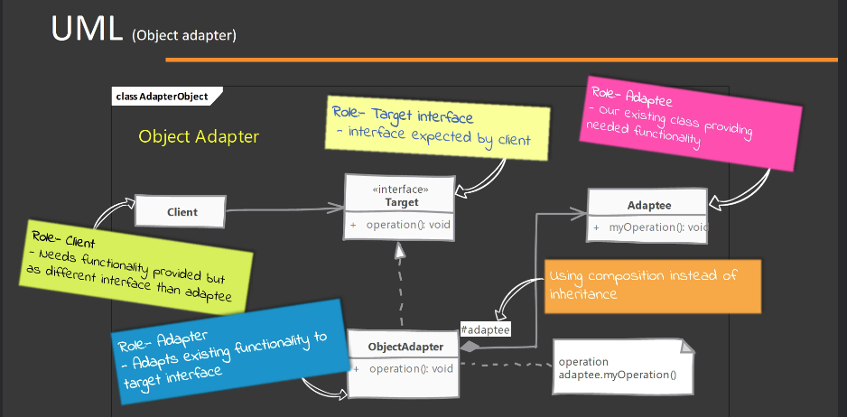

#### Implementation :

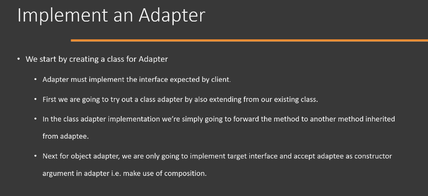

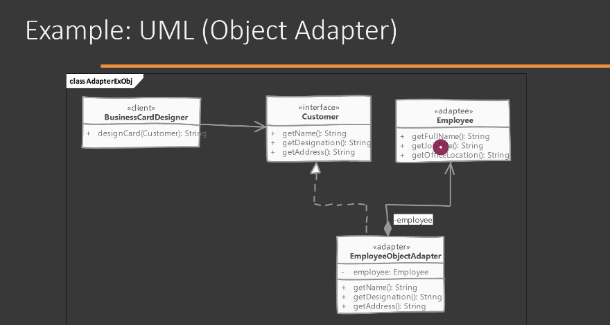

#### Scenario :
- Employee (existing class) -> Customer (used by client code to design business cards).
- To convert employee to customer, we need an adapter, which uses Employee's information and convert it to Customer.

#### Implementation Considerations :
- How much work the adapter does, depends upon the differences between target interface & object being adapted.
- If method arguments & parameters are same, the amount of work done by adapter will also be less.
- Fixing defects in case of adapters is difficult, so keeping method delegations simple is a way to win.

#### Example :
- java.io.InputStreamReader & java.io.OutputStreamWriter are examples of object adapters.
- These classes adapt existing InputStream / OutputStream object to Reader / Writer interfaces.

#### Comparison with Decorator :

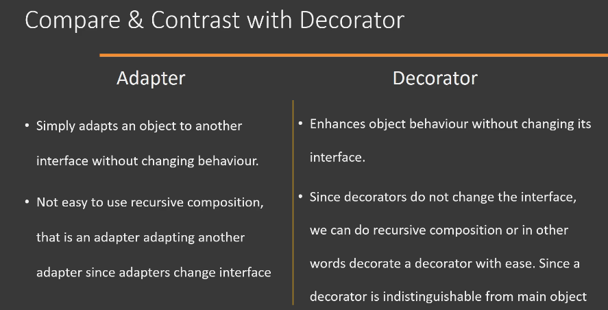

#### Pitfalls :
- Complexity: Introducing adapters can sometimes add complexity to the codebase, especially if multiple adapters are used to adapt different interfaces.

- Overuse: It's possible to overuse the Adapter pattern, especially in cases where a simpler solution might suffice. This can lead to unnecessary abstraction layers and decreased code readability.

- Performance Overhead: Depending on the implementation, using adapters might introduce a performance overhead, especially if the adaptation process involves heavy transformations or computations.

- Tight Coupling: If not designed carefully, adapters can lead to tight coupling between components, making the codebase less flexible and harder to maintain.

#### Difference between Class Adapter & Object Adapter :

* Object Adapter:

Composition: In the Object Adapter pattern, the adapter contains an instance of the adaptee class. It uses this instance to perform the necessary adaptation.

Flexibility: Object Adapter is more flexible than the Class Adapter because it allows adapting subclasses of the adaptee and multiple adaptee classes through polymorphism.

Ease of Use: It's easier to implement Object Adapter as it doesn't rely on multiple inheritance or interface implementation, making it suitable for languages like Java that do not support multiple inheritance.

Example: In Java, you might have an interface Target that your client expects to use. The Adapter class would implement this Target interface and contain an instance of the Adaptee class. It delegates the requests from the client to the Adaptee instance, adapting them as necessary.

* Class Adapter:

Inheritance: In the Class Adapter pattern, the adapter inherits from both the target interface and the adaptee class.

Multiple Inheritance: Class Adapter relies on multiple inheritance, which is not supported in languages like Java (though it can be emulated with interfaces and delegation).

Limitations: Due to the use of multiple inheritance or interfaces with delegation, the Class Adapter might be less flexible and more complex than the Object Adapter.

Example: In Java, the Adapter class would extend the Adaptee class and implement the Target interface. It overrides or extends methods from the Adaptee class to adapt them to the interface expected by the client.

#### Bridge Design Pattern :
- Our implementation class & its abstraction are generally coupled to each other in normal inheritance.
- Using bridge pattern, we decouple them so they can change without affecting each other.
- We achieve this by creating two separate inheritance heirarchies, one for implementation and another for abstraction.
- We use composition to bridge these heirarchies.

#### Implementation :
- Determine common operations and define them in abstraction.
- Define our implementor, implementor methods do not have to match with abstractor methods.
- Then we write one or more implementors providing implementations.
- Abstraction can carry out its work by using implementor methods.

- Note : Abstractions are created by composing them with an instance of concrete implementor (used by methods in abstractor).

#### UML :

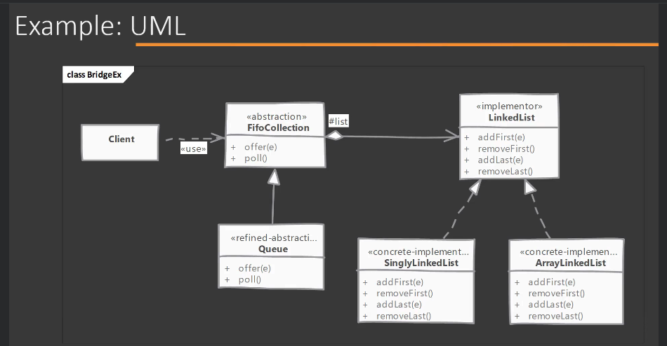

#### Implementation Considerations :
- In case, we are gonna have single implementor (for example : SinglyLinkedList), then we can skip creating abstract implementor.
- Abstractor gives decouple feeling, as it do not know which implementor client is referring.

#### Design Considerations :
- Bridge design pattern gives great flexibility to change abstraction & implementation separately, you can package & build them separately to modularize overall system.
- We can also make use of abstract factory design pattern to create abstraction objects with correct implementation, you can decouple concrete implementors from abstraction.

#### Example :
- java.sql.DriverManager class with java.sql.Driver interface forms a bridge pattern.
- The actual implementation for Driver class defers to the use of databases (Driver, OracleDriver).
- Collections.newSetFromMap() method returns a set which is backed from a given map.

#### Comparison with Bridge Design Pattern :

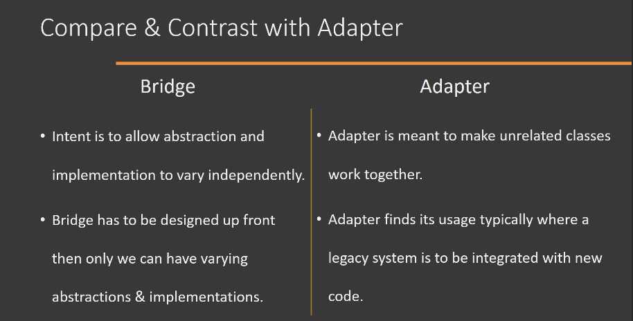

#### Pitfalls :
- Fairly complex to understand.
- Need to have a well thought & fairly comprehensive design in front of you before you can decide on bridge pattern.
- Needs to be designed upfront, adding bridge to the legacy code is difficult. Even for ongoing project, adding bridge later in time may require fair amount of rework.

#### Decorator Design Pattern :
- When we want to enhance behaviour of our existing object dynamically, then we use decorator design pattern.
- Decorator wraps an object within itself, provides the same interface as wrapped object, so the client code of original object does not need to change.
- An alternative to subclassing, making existing classes extend their functionalities.

#### Implementation Steps :
- Start with Component (any interface).
- Component defines interface that is already being used by Client.
- We define our Decorator. Decorator implements Component & also needs reference to Concrete Component.
- In Decorator methods, we provide additional behaviour on top of that provided by Concrete Component interface.
- Decorator can be abstract as well, depending on subclasses to provide functionality.

#### UML :

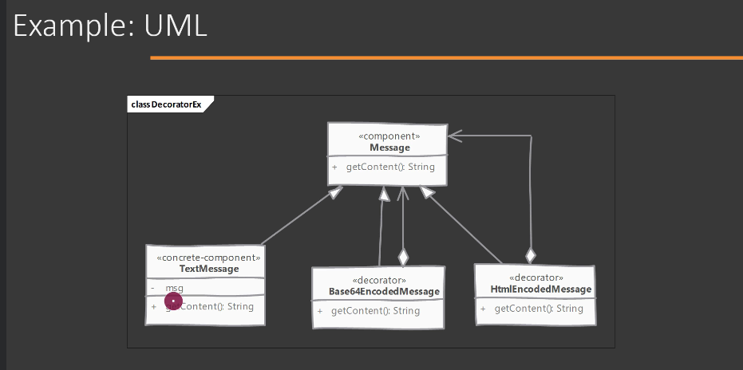

#### Implementation & Design Considerations :
- Pay attention to hashCode() and equals() as you have to decide if object is equal to same instance with decorator.
- Decorators support recursive composition, and so this pattern leads to creation of lots of small objects that leads "small functionalities". This becomes difficult to debug after certain extent.
- Decorators are more flexible and powerful than inheritance. Inheritance are static by definition but decorators allows you to dynamically compose behaviours at runtime.
- Decorators should act like additional skin to your object, They should add helpful small behaviours to object's original behaviour. Do not change meaning of operations.

#### Example :
- java.io package is great example of decorator pattern.
- BufferedOutputStream decorates java.io.OutputStream object. 
- To the existing OutputStream object, BufferedOutputStream object adds additional buffering capability to file writing operation, thus improving the disk i/o performance by reducing the number of writes.

#### Comparison with Composite :

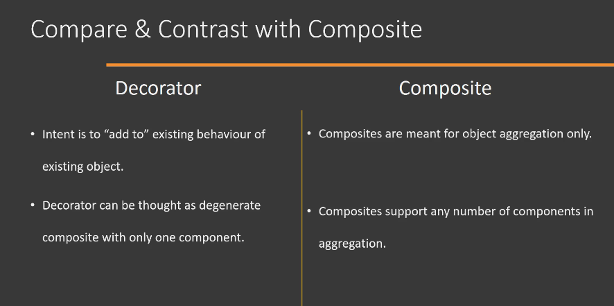

#### Composite Design Pattern :
- Imagine you have a tree structure, where each node in the tree can be either a leaf or a branch.
- Leaf nodes are the smallest elements in the tree. They don't have any children and represent the basic building blocks.
- Branch nodes are composed of one or more child nodes, which can be either leaf nodes or other branch nodes. They represent the structural elements that organize and group the leaf nodes.
- The Composite design pattern is like a way to treat individual objects and compositions of objects (branches) uniformly.

It lets clients treat individual objects and compositions of objects uniformly.
So, whether you have a single leaf node or a whole branch of nested nodes, you can interact with them in the same way.
Here’s a simple analogy:

Think of building blocks like LEGO. Each LEGO piece can be considered a leaf node. It's a standalone piece. But you can also combine several LEGO pieces together to create more complex structures like houses, cars, or even entire cities. These complex structures are like branch nodes.

With the Composite pattern, you can interact with both individual LEGO pieces and complex structures in the same way. You can connect them, detach them, or even iterate over them without needing to know if you're dealing with a single piece or a structure made of many pieces.

In summary, the Composite pattern helps you to work with individual objects and compositions of objects in a uniform manner, simplifying the code and making it more flexible.

#### Implementation Steps :
- Create an abstract class / interface for Component.
- Component must declare all methods that are applicable to both leaf and composite.
- We have to choose who defines the children management operations, component or composite.
- Then we finally implement the Composite. An operation invoked on Composite is propagated to all its children.
- In leaf nodes, we have to handle the non-applicable operations like add/remove a child if they are defined in Component.
- File -> Directory, Directory is a Composite class.

#### UML :

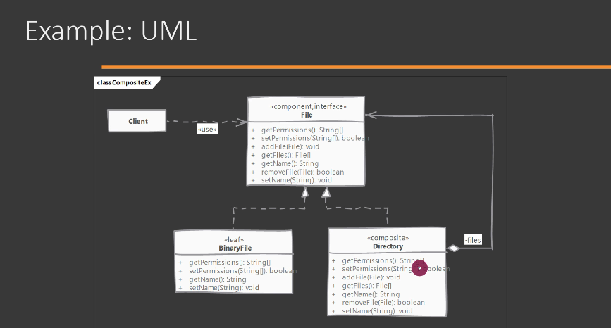

#### Implementation & Design Considerations :
- You can provide a method to access parent of a node. This will simplify traversal of the entire tree.
- Defining the collection field of children in base component instead of composite.
- If we have a node that is immutable and is repeating 100 of times, we can cache them and save memory.
- Decision needs to be done about where to define children management operations. Defining them on component provides transparency but leaf nodes are forced to implement those methods. Defining them on composite is safer but client needs to be made aware of composite.
- Overall goal of design should be make client code easier to implement when using composite.

#### Examples :

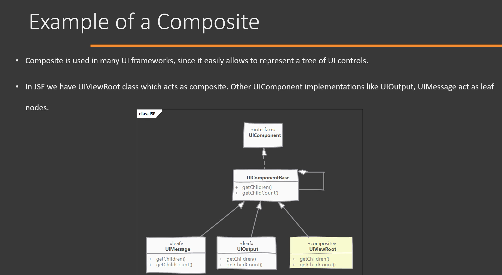

#### Comparison with Decorator :

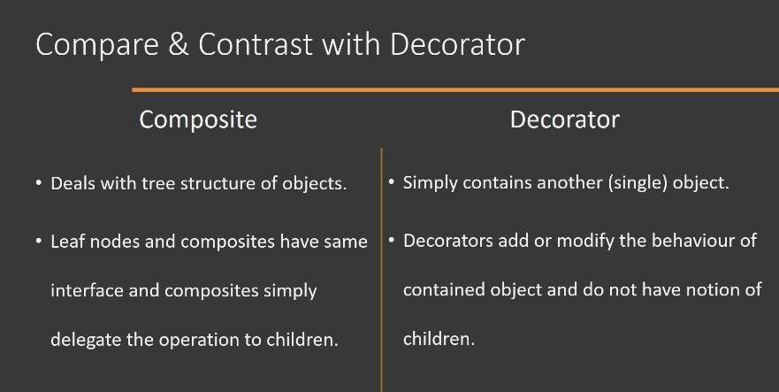

#### Pitfalls :
- Difficult to restrict what is added to heirarchy.
- If multiple types of leaf nodes are present in the system, then client code ends up doing runtime checks to ensure the operation is available on a node.
- Creating the original heirarchy can still be complex implementation especially if you are using caching to reuse nodes and number of nodes are still high.

#### Facade Design Pattern :
- Client has to interact with large number of interfaces & subclasses inorder to get the result. So in that case, client gets tightly coupled with those interfaces & classes. Facade solves this problem.
- Think of facade as a system that interacts with further subsystems to satisfy client requests.

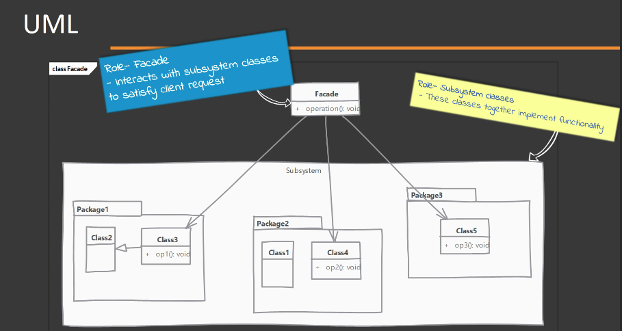

#### Implementation :
- Start by creating a class that will serve as a Facade.
- We determine the overall use-case/tasks that the subsystems is used for.
- We write a method that exposes each use case or task.
- This method takes care of working with different classes of subsystem.

#### UML :

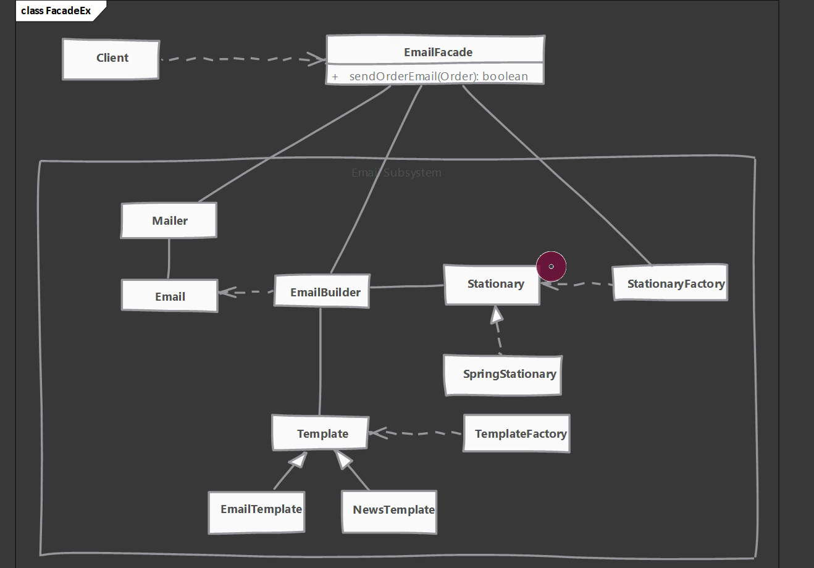

#### Implementation & Design Considerations :
- A facade should minimize the complexity of subsystem and provide usable interface.
- You can have an interface or abstract class for facade and client can use different subclasses to talk to different subsystem implementations.

- Facade is a great solution to simplify dependencies. It allows you to have a weak coupling between subsystems.
- If your concern is coupling of client code to subsystems specific classes and not worried about simplification provided by a facade, then you can use abstract factory pattern in place of facade.

#### Example :
- java.net.URL is a facade class. This class provides a method called openStream() and we get an input stream to the resource pointed by the URL object.
- This way all the complexities of dealing with multiple classes from the java.net package as well as some internal sun packages is abstracted out.

#### Comparison with Adapter :

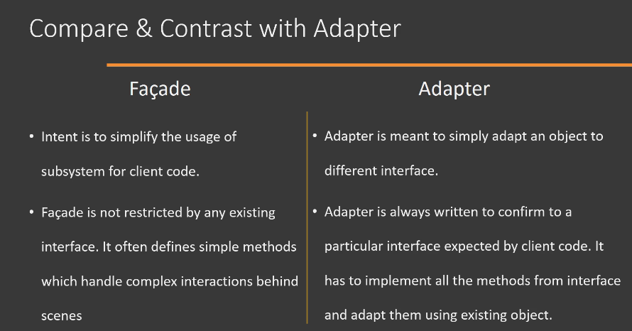

#### Pitfalls :
- It is often overused or misused, it can hide improperly designed API's.
- A common misuse is to use them as "container of related methods".

#### Flyweight :
- Our system needs a large number of objects of particular class & maintaining these instances is a performance concern.
- Flyweight allows us to share an object in multiple contexts. But instead of sharing entire object (not feasible), we divide an object's state in two parts : intrinsic & extrinsic. Intrinsic state is a state that is shared in every context while extrinsic state is a state which is context specific.
- We create object with only intrinsic state and share it in various contexts.
- Client provides the extrinsic state to object to carry out its functionality.

- Flyweight design pattern is a Structural design pattern like Facade pattern, Adapter Pattern and Decorator pattern. Flyweight design pattern is used when we need to create a lot of Objects of a class. Since every object consumes memory space that can be crucial for low memory devices, such as mobile devices or embedded systems, flyweight design pattern can be applied to reduce the load on memory by sharing objects. Before we apply flyweight design pattern, we need to consider following factors:

The number of Objects to be created by application should be huge.
The object creation is heavy on memory and it can be time consuming too.
The object properties can be divided into intrinsic and extrinsic properties, extrinsic properties of an Object should be defined by the client program.
To apply flyweight pattern, we need to divide Object property into intrinsic and extrinsic properties. Intrinsic properties make the Object unique whereas extrinsic properties are set by client code and used to perform different operations. For example, an Object Circle can have extrinsic properties such as color and width. For applying flyweight pattern, we need to create a Flyweight factory that returns the shared objects. For our example, lets say we need to create a drawing with lines and Ovals. So we will have an interface Shape and its concrete implementations as Line and Oval. Oval class will have intrinsic property to determine whether to fill the Oval with given color or not whereas Line will not have any intrinsic property.

#### Implementation :
- Start by identifying "intrinsic" & "extrinsic" state of our object.
- We create an interface for flyweight to provide common methods that accept exitrinsic state.
- In implementation of shared flyweight we add intrinsic state & also implement methods.
- In unshared implementation of flyweight we simply ignore the extrinsic state argument as we have all state within object.
- Next, we implement the flyweight factory which caches flyweights & also provides methods to get them.
- In our client code, we either maintain that extrinsic state or calculate it on the fly using flyweight.

#### UML :

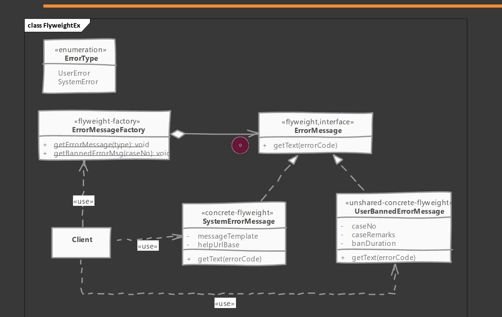

#### Implementation & Design Considerations :
- Factory is always necessary as client code needs easy way to get hold of shared flyweight.
- Also number of shared instances can be large so central place is good strategy to keep track of all of them.
- Flyweight's intrinsic state should be immutable in order to successfully implement flyweight.

- Usability of flyweight is entirely dependent upon presence of sensible extrinsic state in object which can be moved out of object without any issue.
- Some design patterns like state & strategy can make best use of flyweight pattern.

#### Example :
- java.lang.Integer, Short, Byte etc. Here the valueOf static method serves as factory method.
- Internally they cache some objects and returns them when needed.
- StringPool is another example of flyweight design pattern. 

```
public static Integer valueOf(int i) {
    if (i >= IntegerCache.low && i <= IntegerCache.high) {
        return IntegerCache.cache[i + (-IntegerCache.low)];
    }
    return new Integer(i);
}

```

#### Comparison with Object Pool :

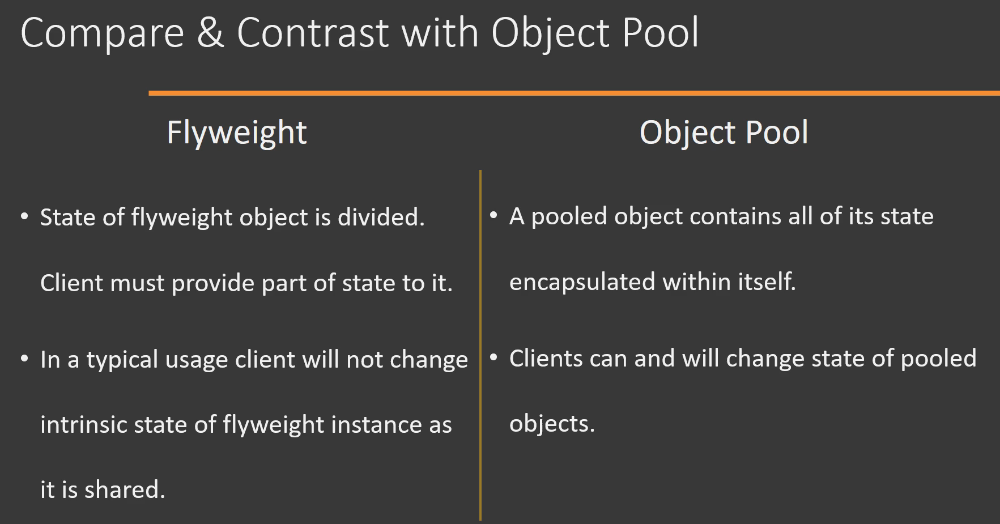

#### Pitfalls :
- Runtime cost must be added for maintaining extrinsic state. Client code has to either maintain it or compute it every time it needs to use flyweight.
- It is often difficult to find perfect candidate objects for flyweight. GUI applications heavily benefit from this pattern.

#### Proxy Design Pattern :
- "Proxy" means in-place of.
- It is used when you want to provide a placeholder or surrogate to another object.
- Proxy acts on behalf of original object due to following reasons -
    * Protection Proxy - controla access to original object's operations.
    * Remote Proxy - Provides a local representation of remote object.
    * Virtual Proxy - Delays construction of original object until absolutely necessary.
- Client is unaware of proxy. Proxy performs its work transparently.

#### Implementation Steps :
- Proxy must implement same interface as real subject.
- We can either create actual object later when required or ask for one in constructor.
- In method implementation of proxy, we implement proxy's functionality before delegating to real object.
- Our application needs to decide, exactly when & where to provide proxy instance to client.

#### UML :

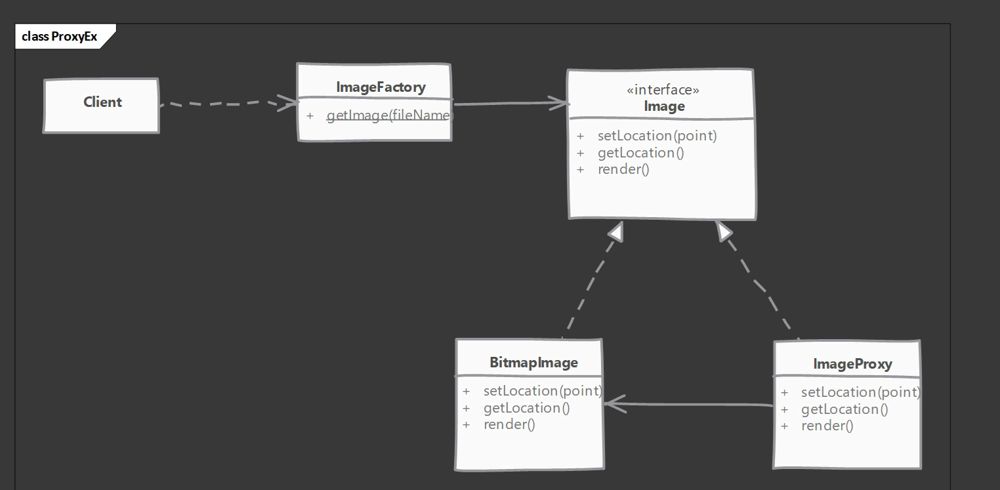

Note : Visit the dynamic proxy example again.

#### Implementation & Design Considerations :
- For creation of on-demand types of proxies, actual object is created only when proxy can't handle the requests.
- Authentication proxies use pre-built objects so they are provided with object during construction of proxy.
- Proxy itself can maintain/cache some state on behalf of real object in creation on demand use cases.
- Pay attention to performance cost of proxies as well synchronization issues added by proxy itself.

- Also, proxies typcially do not need to know about the actual concrete implementation of real object.
- With java, you can create dynamic proxies allowing you to create proxies for any object at runtime.
- Proxies can be great for implementing security or as stand-ins for real objects which may be a costly object that you want to defer loading.

#### Example :
- Lazy loading in hibernate is done using proxy design pattern. If you have any relationship in entity class mapped as collection, and that candidate is marked as lazy loading then hibernate will provide a virtual proxy in place.
- Spring uses proxy pattern to provide support for features like transcations, caching and general AOP support.

#### Comparison with Decorator :

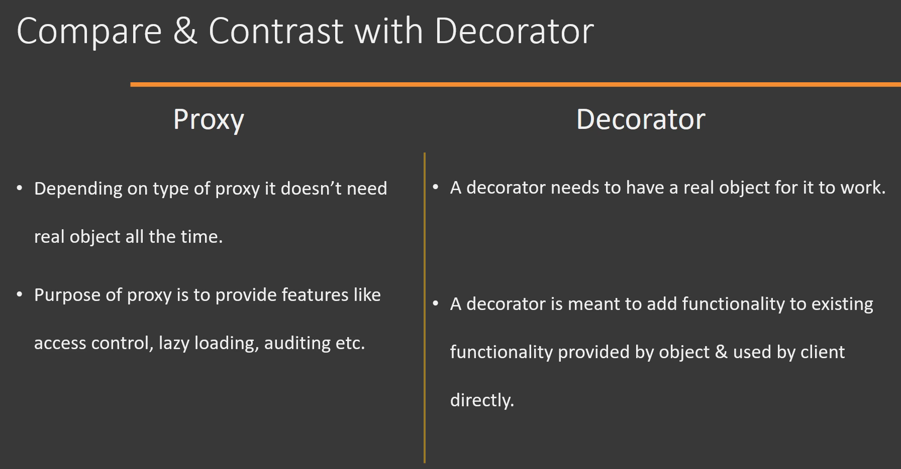

#### Pitfalls :
- If you need proxies for handling multiple responsibilities like auditing, authentication, as a stand-in for the same instance, then its better to have a single proxy to handle all these requirements. Due to the way some proxies create objects on their own, it becomes quite difficult to manage them.
- Static proxies look quite similar to other patterns like decorator & adapter patterns. It can be confusing to figure out from code alone for someone not familiar with all these patterns.

### Behavioural Design Patterns