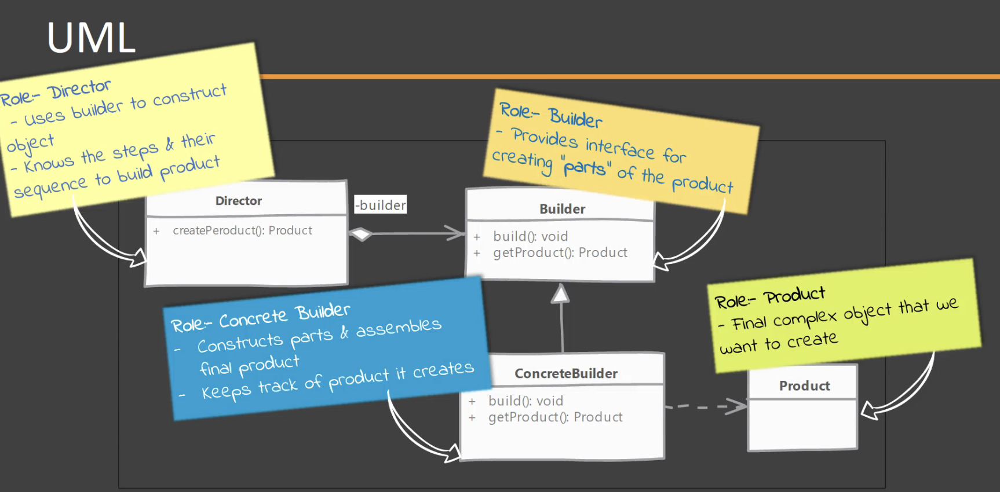

## Design Patterns

### Creational Design Patterns

#### Builder :
- We have a complex process to construct an object involving multiple steps, then builder pattern can help us.

- In builder, we remove the logic related to object construction from "client" code & abstract it in a separate class.

### Structural Design Patterns

### Behavioural Design Patterns