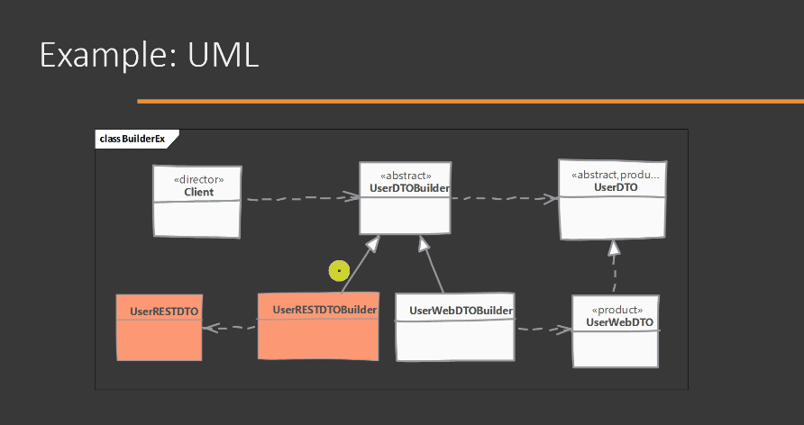

## Design Patterns

### Creational Design Patterns

#### Builder :
- We have a complex process to construct an object involving multiple steps, then builder pattern can help us.

- In builder, we remove the logic related to object construction from "client" code & abstract it in a separate class.

- Implement a builder :
* We start by creating a builder, identifying the parts of the product & provide methods to create those parts.
* It should provide a method to assemble or build the product/object.
* It must provide a way (method) to get fully built object out.
* Optionally - builder can keep reference to a product it has built so the same can be returned again in future.

- Implement a director : 
* A director can be a separate class or client can play the role of director.

### Structural Design Patterns

### Behavioural Design Patterns