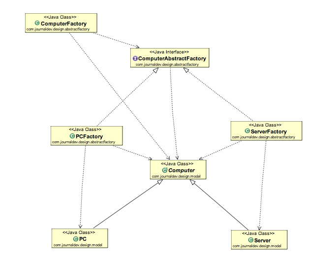

## Design Patterns

### Creational Design Patterns

#### Builder :
- We have a complex process to construct an object involving multiple steps, then builder pattern can help us.

- In builder, we remove the logic related to object construction from "client" code & abstract it in a separate class.

- Implement a builder :
* We start by creating a builder, identifying the parts of the product & provide methods to create those parts.
* It should provide a method to assemble or build the product/object.
* It must provide a way (method) to get fully built object out.
* Optionally - builder can keep reference to a product it has built so the same can be returned again in future.

- Implement a director : 
* A director can be a separate class or client can play the role of director.

#### Problem Builder Design Pattern Solves -
The Builder design pattern solves the problem of constructing complex objects step by step while allowing different variations or representations of the object to be created. It is useful when an object has a complex construction process with many optional parameters or configurations, and you want to separate the construction logic from the object's main business logic.

With the Builder pattern, you can create an object piece by piece, specifying only the components you need, and then use a director (optional) to orchestrate the construction process. This helps in making the construction process more flexible, maintainable, and easier to understand, especially when dealing with objects with multiple configurations or variations.

##### Example -
- StringBuilder class in java.lang.StringBuilder is a builder design pattern implemented class according to GoF definition.
- Builder has potential to build different representations of product interface step by step.
- Calendar class is also a builder design pattern implemented class.

#### Comparison with Prototype design pattern -

#### Consideration -
- Think of builder dp when you have a complex constructor or an object is built in multiple steps.

#### Simple Factory Design Pattern :

- Separate class will be created to implement Simple Factory.
- A method will be created which will return desired object instance.
- This method will typically accept some argument to decide which class to instantitate.
- You can also provide additional arguments which will be used to instantitate objects.

##### Examples -
- java.text.NumberFormat class has getInstance method, which is an example of Simple Factory.

#### Comparison with Factory Method Pattern :

#### Issues :
- The criteria used by Simple Factory to decide which object to instantitate can get more convoluted / complex over time. If you find yourself in such situation then use factory method design pattern.

#### Factory Method Design Pattern :
- Used when we want to move object creation logic out , in a separate class.
- We use this DP, when we don't know in advance which class we may need to instantitate beforehand & also to allow new classes to be added to system and handle their creation without affecting client code.
- We let subclasses decide which object to instantiate by overriding the factory method.

#### Examples :
- java.util.Collection class has a method - iterator(), which is a factory method.
- The most defining characteristic of factory method pattern is - "subclasses providing the actual instance".

#### Issues :
- More complex to implement. More classes involved and need unit testing.
- Not easy to refactor.
- Forces to create subclass to create appropriate object instance.

#### Summary :
- Used when you want to delegate object instantiation to subclasses, you would want to do this when you have "product" heirarchy and possibility of future additions to that.
- We can end up creating conrete classes based on the new requirements of object instantitation.
- For each product concrete class, its corresponding creator class will be added.
    - JSONMessage -> JSONMessageCreator
    - TextMessage -> TextMessageCreator

#### Prototype Design Pattern :
- We have a complex object that is costly to create.
- To create more instances of such classes, we can use existing instances as our prototype.
- Prototype allows us to clone existing objects, and hence saves cost of creating such objects again.

#### Steps :
- A class implementing Cloneable interface.
- Class should override clone() and return copy of itself.
- The method should declare CloneNotSupportedException.
- Clone method implementation should consider the deep & shallow copy and choose whichever is applicable.

#### Considerations :
- Making sure deep copy & shallow copy of references, immutable fields on clones should save the trouble of deep copy.
- Making sure to reset the state of object before returning its prototype.
- clone() method is protected in Object class and must be overridden to be public to be callable from child class.
- Cloneable is a marker interface, an indication that the class supports cloning.

#### Design Considerations :
- Prototypes are useful when you have large objects where majority of state is unchanged between instances and you can easily identify the state.
- A prototype registry is a class where you can register various prototypes which other code can access to clone out instances. This solves the issue of getting access to initial instance.

#### Example :
- Object.clone() itself is an example of Prototype.

#### Comparison with Singleton :

#### Pitfalls :
- Deep copy is by default not supported by Object.clone(), you have to implement it.
- Subclasses may not be able to support clone and so the code becomes complicated as you have to implement wherever it is not supported.

#### Summary :
- Think of prototype when object construction is costly or not possible.
- In Java, its typically implemented within clone().
- Objects which have majority of fields as immutable are good candidates for prototypes.
- Whenever implementing clone(), pay attention to the choice of shallow & deep copy.

#### Abstract Factory Design Pattern :

- Abstract Factory makes use of factory method pattern.
- You can think of AF as an object with multiple factory methods.

#### Implementation Considerations :
- Factories can be singleton, we typically ever need only one instance of it anyway.
- Adding a new product type requries changes to the base factory as well as implementation of factory.
- We provide the client code with concrete factory.
- Abstract Factory itself uses factory method pattern.
- If objects are too expensive to create, then you can transparently switch factory implementations to use prototype design pattern to create objects.

### Structural Design Patterns

### Behavioural Design Patterns